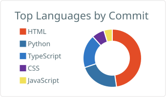
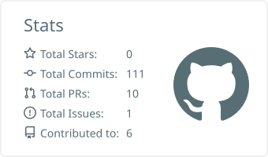

<div align="center">

<!-- Hero Banner (auto-switches with GitHub's dark/light theme) -->
<picture>
  <source media="(prefers-color-scheme: dark)" srcset="./assets/dark.svg">
  <source media="(prefers-color-scheme: light)" srcset="./assets/light.svg">
  
</picture>

<br/>

<!-- Profile Views + Followers -->

&nbsp;


</div>

---

## 🧑‍💻 About Me

```javascript
const samiul = {
  name:        "Samiul Islam Audi",
  location:    "Dhaka, Bangladesh 🇧🇩",
  university:  "BRAC University — BSc. in CSE",
  focus:       ["Frontend Development", "Full-Stack (MERN)", "AI/ML", "Robotics"],
  currentWork: "CoinPulse 💰 — Crypto Tracker App",
  recentBuild: "GojoBot Arm 🤖 — ROS 2 + MoveIt 2 robotic manipulator",
  roverTeam:   "Controls & Software Team Member @ BRACU Mongol Tori 🚀 (University Mars Rover Team)",
  funFact:     "I once fixed a bug at 3AM and felt like the Dark Knight ⚡",
  openTo:      ["Internships", "Collaborations", "Open Source"]
};
```

---

## 🚀 BRACU Mongol Tori — University Mars Rover Team

**Controls & Software team member** at **BRACU Mongol Tori** 
BRAC University's Mars Rover engineering team

---

## 🔗 Connect With Me

<div align="center">

[](https://www.linkedin.com/in/samiul-islam-audi-bb7268244/)
[](https://www.facebook.com/share/1av8986ykr/)
[](https://www.hackerrank.com/profile/samiul2304audi)
[](https://codeforces.com/profile/samiul2304audi)
[](https://leetcode.com/u/samiul2304audi/)
[](https://www.codechef.com/users/samiul2304audi)

</div>

---

## 🛠️ Tech Stack & Tools

<div align="center">

**Frontend**


**Backend & Database**


**Robotics & Simulation**


**Languages**


**Design & Tools**


</div>

---

## 🤖 Featured Robotics Project — GojoBot Arm

An autonomous robotic manipulator built on **ROS 2 Humble** and **MoveIt 2**, featuring real-time
3D obstacle avoidance, multi-threaded trajectory sequencing, and a statistical Monte-Carlo
path-confidence engine.


**Highlights:**
- Four asynchronous ROS 2 nodes coordinating obstacle placement, scripted trajectory execution,
  and two custom bonus services
- `PlanConfidence` — a Monte-Carlo diagnostic service that plans a target pose $N$ times before
  execution and reports a statistical HIGH/MEDIUM/LOW confidence rating
- `GojoTechnique` — a choreographed signature-move showcase (*Hollow Purple* / *Domain Expansion*)
  combining velocity-profile control with live planning-scene manipulation
- Custom ROS 2 interfaces (`ArmStatus.msg`, `PlanConfidence.srv`, `GojoTechnique.srv`) built with
  `ament_cmake`

📁 [Repo: gojobot_arm_ws](https://github.com/samiulaudi1712/gojobot_arm_ws)

---

## 🚀 Deployed Projects

| 🏷️ Project | 📄 Description | 🛠️ Stack | 🌐 Live | 📁 Code |
|:---|:---|:---|:---:|:---:|
| **💰 CoinPulse** | Crypto screener app with a built-in high-frequency terminal & dashboard — live price tracking, candlestick charts, and coin/category browsing powered by the CoinGecko API |     | [🌐 Live](https://coin-pulse-qscj-5n40mri5r-samiul2304audi-8237s-projects.vercel.app/) | [📁 Repo](https://github.com/samiulaudi1712/CoinPulse) |
| **🏠 Rinterio** | Responsive interior decoration company website |     | [🌐 Live](https://samiulaudi1712.github.io/Assignment-3/) | [📁 Repo](https://github.com/samiulaudi1712/Assignment-3) |
| **💪 Fitness Tracker** | Frontend UI for tracking health & fitness |   | [🌐 Live](https://samiulaudi1712.github.io/assignment-2/) | [📁 Repo](https://github.com/samiulaudi1712/assignment-2) |
| **🏛️ G3 Architects** | Landing page for an architecture firm |   | [🌐 Live](https://samiulaudi1712.github.io/G3-Architects/) | [📁 Repo](https://github.com/samiulaudi1712/G3-Architects) |
| **🧑‍💻 Portfolio v1** | Personal developer portfolio — version 1 |   | [🌐 Live](https://samiulaudi1712.github.io/my-portfolio/) | [📁 Repo](https://github.com/samiulaudi1712/my-portfolio) |
| **🧑‍💻 Portfolio v2** | Personal developer portfolio — version 2 |   | [🌐 Live](https://samiulaudi1712.github.io/milestone-1-assignment/) | [📁 Repo](https://github.com/samiulaudi1712/milestone-1-assignment) |

---

## 📊 GitHub Stats

<!-- GitHub Profile Summary Cards -->
<div align="center">
  
  
  <br/><br/>
  
  
</div>
---


</div>

---

<div align="center">


</div>


## 🏆 GitHub Trophies

<div align="center">


